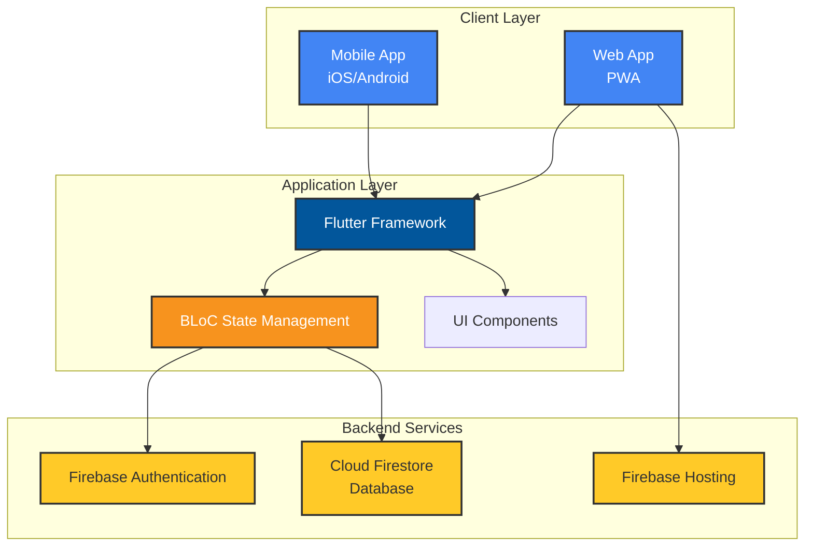
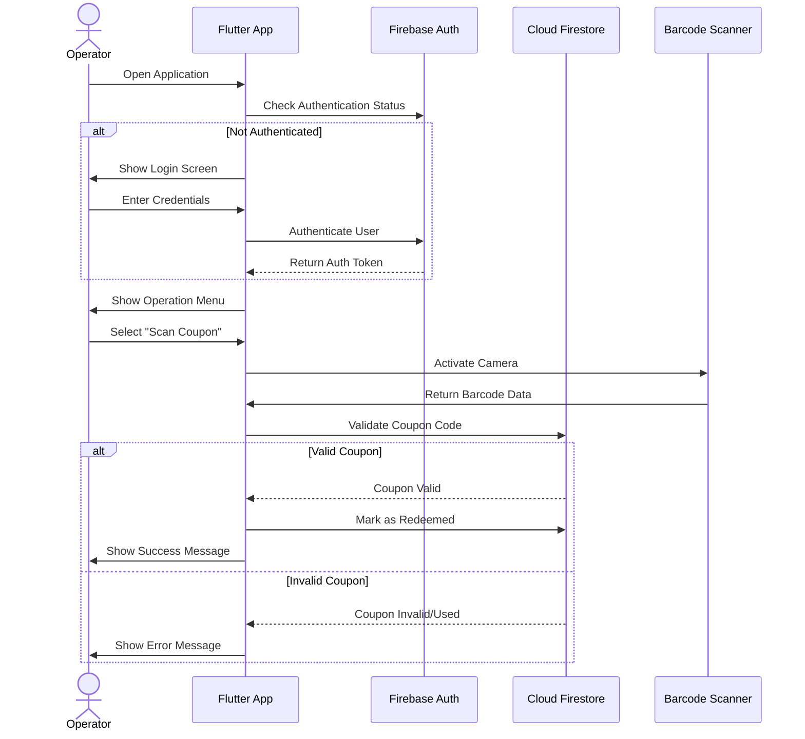
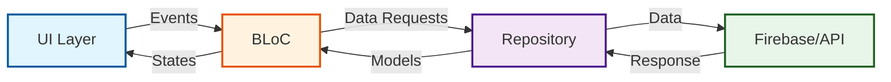
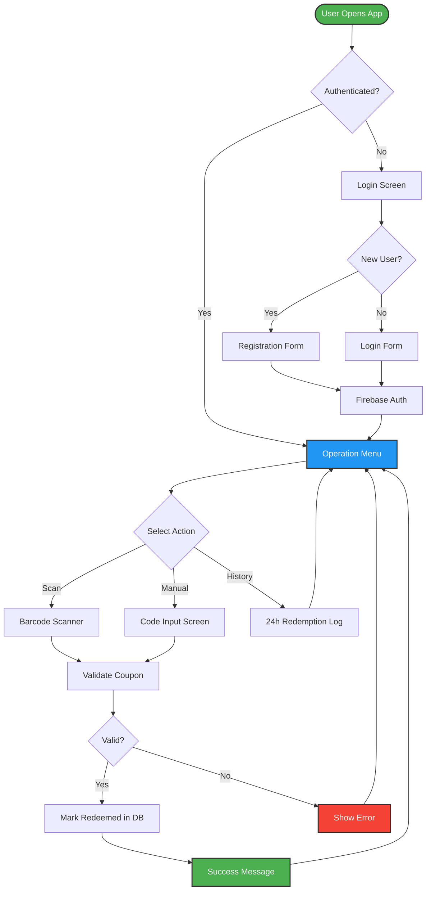

# CLP Power Coupon - Operator Application

<div align="center">
  

  [](https://flutter.dev)
  [](https://firebase.google.com)
  [](https://dart.dev)

  **A cross-platform coupon management and redemption system for operators**
</div>

## 📋 Table of Contents

- [Overview](#-overview)
- [Features](#-features)
- [System Architecture](#-system-architecture)
- [Technology Stack](#-technology-stack)
- [Getting Started](#-getting-started)
- [Project Structure](#-project-structure)
- [Testing](#-testing)
- [Deployment](#-deployment)
- [Localization](#-localization)
- [Contributing](#-contributing)
- [Contact](#-contact)
- [License](#-license)

## 🎯 Overview

The **CLP Power Coupon Operator App** is a comprehensive digital coupon redemption system designed for operators to manage and process coupon redemptions efficiently. Built with Flutter for cross-platform compatibility, the application provides a seamless experience across mobile (iOS/Android) and web platforms.

### Key Capabilities

- **Digital Coupon Redemption**: Fast and efficient coupon processing
- **Multi-Platform Support**: Works on Android, iOS, and Web
- **Real-time Validation**: Instant coupon verification through Firebase
- **QR/Barcode Scanning**: Quick redemption via device camera
- **Multi-Language Support**: English and Traditional Chinese (繁體中文)
- **Offline-Ready**: PWA capabilities for web version

## ✨ Features

### Core Features

- **User Authentication**
  - Email/password registration and login
  - Firebase Authentication integration
  - Secure session management
  - Password recovery

- **Coupon Redemption**
  - 📱 QR/Barcode scanning (mobile)
  - ⌨️ Manual code entry
  - ✅ Real-time validation
  - 📊 Redemption history (24-hour log)

- **User Interface**
  - 🎨 Modern, animated UI components
  - 🌐 Multi-language support (EN/繁體中文)
  - 📱 Responsive design
  - ♿ Accessibility features

- **Operator Tools**
  - Dashboard with operation menu
  - Redemption logs and history
  - CSV export capabilities
  - Real-time sync with Firebase

## 🏗 System Architecture

### High-Level Architecture



### Application Flow



### BLoC Architecture Pattern



### Data Flow



## 🛠 Technology Stack

### Frontend

| Technology | Version | Purpose |
|------------|---------|---------|
| **Flutter** | SDK >=2.7.0 <3.0.0 | Cross-platform UI framework |
| **Dart** | 2.7+ | Programming language |
| **flutter_bloc** | 0.19.1 | State management |
| **animations** | 1.1.2 | Smooth UI animations |
| **simple_animations** | 2.2.2 | Advanced animations |
| **google_fonts** | 1.1.0 | Custom typography |

### Backend & Services

| Service | Purpose |
|---------|---------|
| **Firebase Authentication** | User authentication & authorization |
| **Cloud Firestore** | Real-time NoSQL database |
| **Firebase Hosting** | Web app hosting & CDN |
| **Firebase App Distribution** | Mobile app distribution for testing |

### Device Features

| Package | Purpose |
|---------|---------|
| **barcode_scan** | QR/Barcode scanning capability |
| **shared_preferences** | Local data persistence |
| **fluttertoast** | Native toast notifications |

### UI/UX Libraries

| Package | Purpose |
|---------|---------|
| **font_awesome_flutter** | Icon library |
| **flutter_signin_button** | Pre-styled sign-in buttons |
| **sized_context** | Responsive sizing utilities |
| **cupertino_icons** | iOS-style icons |

## 🚀 Getting Started

### Prerequisites

Before you begin, ensure you have the following installed:

- **Flutter SDK** (2.7.0 or higher)
  ```bash
  flutter --version
  ```
- **Dart SDK** (2.7.0 or higher)
- **Android Studio** (for Android development)
- **Xcode** (for iOS development, macOS only)
- **Firebase CLI** (for deployment)
  ```bash
  npm install -g firebase-tools
  ```
- **Node.js & npm** (for Playwright E2E testing)

### Installation

1. **Clone the repository**
   ```bash
   git clone https://github.com/cyrsis/clppowercoupon.git
   cd clppowercoupon
   ```

2. **Install Flutter dependencies**
   ```bash
   flutter pub get
   ```

3. **Install Node.js dependencies** (for E2E testing)
   ```bash
   npm install
   ```

4. **Firebase Configuration**

   The project is already configured with Firebase. If you need to set up your own Firebase project:

   - Create a Firebase project at [Firebase Console](https://console.firebase.google.com)
   - Enable Authentication (Email/Password)
   - Enable Cloud Firestore
   - Download configuration files:
     - `google-services.json` → `android/app/`
     - `GoogleService-Info.plist` → `ios/Runner/`
   - Update web configuration in `web/index.html`

5. **Run the application**

   **For Web:**
   ```bash
   flutter run -d chrome
   ```

   **For Android:**
   ```bash
   flutter run -d android
   ```

   **For iOS:**
   ```bash
   flutter run -d ios
   ```

### Default Test Credentials

For testing purposes, you can use:

```
Email: admin@admin.com
Password: 123321
```

⚠️ **Important**: Change these credentials in production!

## 📁 Project Structure

```
clppowercoupon/
├── lib/
│   ├── main.dart                      # Application entry point
│   ├── SignInScreen.dart              # Login screen
│   ├── RegisterScreen.dart            # User registration
│   ├── OperationMenuScreen.dart       # Main operator menu
│   ├── CodeForRedeemScreen.dart       # Manual code entry
│   │
│   ├── Bloc/                          # State Management
│   │   ├── IntlBloc/                  # Internationalization
│   │   │   ├── intl_bloc.dart
│   │   │   ├── intl_event.dart
│   │   │   ├── intl_state.dart
│   │   │   └── Repo/IntlRepo.dart
│   │   └── BarcodeScanBlog/
│   │       └── TestBarCodeScanScreen.dart
│   │
│   ├── Styles/                        # UI Components & Styling
│   │   ├── AppColors.dart             # Color palette (200+ colors)
│   │   ├── AppStyle.dart              # Typography & text styles
│   │   ├── AppWidget.dart             # Reusable widgets
│   │   ├── AppAppBar.dart             # Custom app bars
│   │   ├── Applogo.dart               # Logo widget
│   │   ├── Animation/                 # Animation utilities
│   │   ├── Fab/                       # Floating Action Buttons
│   │   └── AnimationText/             # Text animations
│   │
│   ├── l10n/                          # Localization
│   │   ├── intl_en.arb               # English translations
│   │   └── intl_zh_HK.arb            # Traditional Chinese
│   │
│   └── generated/                     # Auto-generated files
│       └── l10n.dart                  # Localization code
│
├── android/                           # Android native code
│   ├── app/
│   ├── gradle/
│   └── fastlane/
│
├── ios/                               # iOS native code
│   ├── Runner/
│   └── Runner.xcodeproj/
│
├── web/                               # Web version
│   ├── index.html                     # Firebase web config
│   ├── manifest.json                  # PWA manifest
│   └── icons/                         # App icons
│
├── test/                              # Unit & Widget tests
│   ├── widget_test.dart
│   └── integration_test/              # Integration tests
│
├── e2e/                               # Playwright E2E tests
│   ├── tests/
│   └── playwright.config.ts
│
├── batch/                             # Build & deployment scripts
│   ├── AndroidFirebaseAppDistribution.sh
│   ├── FirebaseWebDeploy.sh
│   └── FirebaseWebInit.sh
│
├── pubspec.yaml                       # Flutter dependencies
├── package.json                       # Node.js dependencies (E2E testing)
├── firebase.json                      # Firebase configuration
└── README.md                          # This file
```

## 🧪 Testing

### Flutter Widget & Integration Tests

Run Flutter widget tests:
```bash
flutter test
```

Run integration tests on a specific device:
```bash
flutter test integration_test/app_test.dart
```

### End-to-End Testing with Playwright

The project includes Playwright for E2E testing of the web version.

**Run E2E tests:**
```bash
npm run test:e2e
```

**Run E2E tests in headed mode:**
```bash
npm run test:e2e:headed
```

**Run E2E tests with UI:**
```bash
npm run test:e2e:ui
```

**Generate test report:**
```bash
npm run test:e2e:report
```

### Test Coverage

Generate test coverage report:
```bash
flutter test --coverage
genhtml coverage/lcov.info -o coverage/html
open coverage/html/index.html
```

## 📦 Deployment

### Web Deployment (Firebase Hosting)

1. **Build for web:**
   ```bash
   flutter build web
   ```

2. **Deploy to Firebase:**
   ```bash
   firebase deploy --only hosting
   ```

   Or use the provided script:
   ```bash
   ./batch/FirebaseWebDeploy.sh
   ```

### Mobile Deployment

**Android (Firebase App Distribution):**
```bash
flutter build apk --release
./batch/AndroidFirebaseAppDistribution.sh
```

**iOS (TestFlight):**
```bash
flutter build ios --release
# Then upload via Xcode or fastlane
```

## 🌍 Localization

The application supports multiple languages:

- **English (en)** - Default
- **Traditional Chinese (zh_HK)** - 繁體中文

### Adding a New Language

1. Create a new ARB file in `lib/l10n/`:
   ```bash
   cp lib/l10n/intl_en.arb lib/l10n/intl_[locale].arb
   ```

2. Translate all strings in the new ARB file

3. Run code generation:
   ```bash
   flutter pub get
   ```

4. Add the locale to `IntlBloc` in `lib/Bloc/IntlBloc/intl_bloc.dart`

## 🤝 Contributing

We welcome contributions! Please follow these steps:

1. Fork the repository
2. Create a feature branch (`git checkout -b feature/AmazingFeature`)
3. Commit your changes (`git commit -m 'Add some AmazingFeature'`)
4. Push to the branch (`git push origin feature/AmazingFeature`)
5. Open a Pull Request

### Code Style

- Follow [Effective Dart](https://dart.dev/guides/language/effective-dart) guidelines
- Use `flutter format` before committing
- Ensure all tests pass before submitting PR
- Write meaningful commit messages

## 📞 Contact

**Project Maintainer**: Victor

- Email: [victor@budgetapp.works](mailto:victor@budgetapp.works)
- GitHub: [@cyrsis](https://github.com/cyrsis)

## 🔒 Security

### Firebase Configuration

The Firebase configuration is embedded in the codebase for development purposes. For production:

1. Use environment variables
2. Implement Firebase App Check
3. Set up Firestore security rules
4. Enable audit logging

### Reporting Security Issues

Please email security concerns to: victor@budgetapp.works

## 📄 License

This project is proprietary software. All rights reserved.

For licensing inquiries, please contact: victor@budgetapp.works

---

<div align="center">
  <p>Built with ❤️ using Flutter</p>
  <p>© 2020-2025 CLP Power Coupon</p>
</div>
